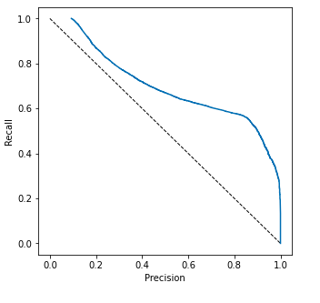
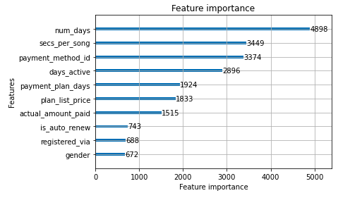
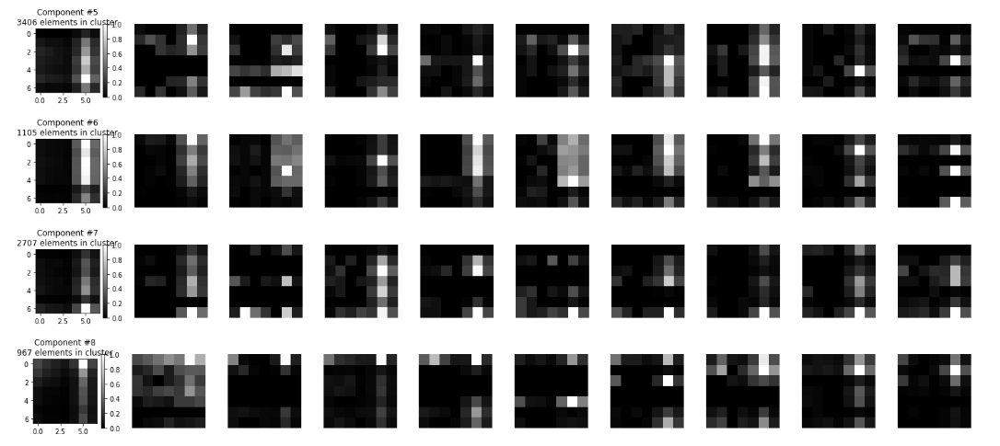

# Churn reduction with time series

## Description
Churn reduction is an interesting problem which has links to customer satisfaction and behavior.
The simplest way to approach it is to use general features related to the customer and then combine them with
 aggregated measurements from app activity. The latter are usually the most informative features but unfortunately
 their rich structure is lost during aggregation. This repository investigates ways to capture some of this structure
 and use it to improve predictions.
 
## Dataset
The dataset used comes from the [WSDM - KKBox's Churn Prediction Challenge
](`https://www.kaggle.com/c/kkbox-churn-prediction-challenge`) kaggle competition. The goal of the competition is to 
predict the churn probability of individual users of KKBOX, a music app. It consists of the following tables:

- `train.csv`: Binary label with churn information
- `members.csv`: General information about the users
- `transactions.csv`: User payment information
- `user_logs.csv`: Logs of the users' app usage. It summarizes the amount of music consumed on a daily basis.

## User metadata and aggregated features
Following this [kernel](https://www.kaggle.com/garylee29181/fork-of-churn) one can quickly create a clean dataset with
aggregates from the time series data and get a baseline with a gradient boosting model. The model yield an average 
precision score of 0.7 and the following precision/recall curve:

The results are reasonable, but one would like to improve performance a bit and also get a better understanding on
why users churn and which behavior expresses this information.

Two of the top features, `secs_per_song` and `days_active`, come from the user log data, indicating that looking 
for more behaviour makes sense.

## Extracting features with autoencoders
Autoencoders are a common tool in dimensionality reduction. The following are some publications with applications 
on time series:
- https://arxiv.org/pdf/1806.02199.pdf
- https://arxiv.org/pdf/2006.08600v1.pdf
- https://arxiv.org/pdf/1412.6581.pdf

In our experimental setup, we extract for each user time series for the 7 different features available in `user_logs`
in intervals of 1 week (starting on Sunday). Then we build an autoencoder which uses 1D CNNs to encode and decompress
this sequence information to a low dimensional space (4-8 dimensions). The compressed space is then used to either
directly get new features per example or cluster the space into groups of similar time series. Below you can see some
examples of such cluster of series. The centroid appears on the left and some samples from each class on the right:

The clustering was performed on a latent space of size 4 fitting a Gaussian mixture with 100 components. The clusters
seem to have well defined patterns.

